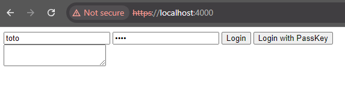
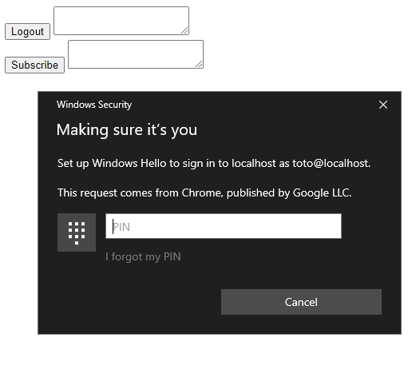
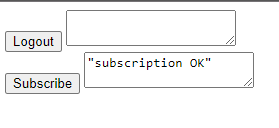
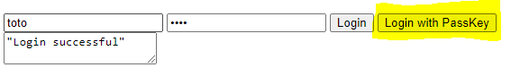
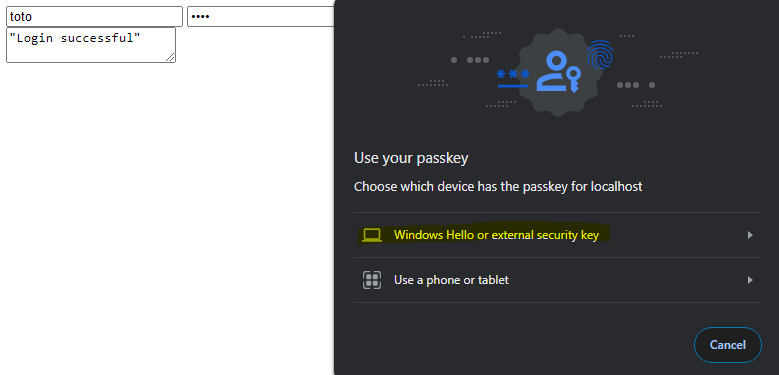
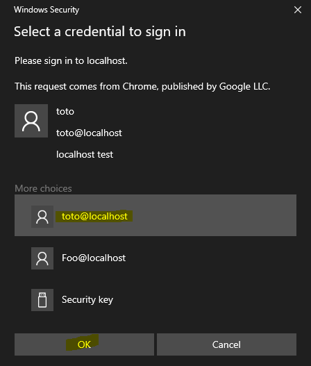

# PassKeyManager - Demo

Discovering the basics of the navigator.credentials API.

## Prerequisites

> Node

A recent browser.

Tested on Chrome 114.0.5735.199

## How to launch

VSCode
> Run / Start Debugging

Or 

> node .\server.js

## Fonctionnal steps

First step = Login with toto / toto combinaison  
  

Second step = subscribing with passkey.  
  

Third step = click on "Logout" button.  
  

Finally = Login with PassKey.  
  
  
  